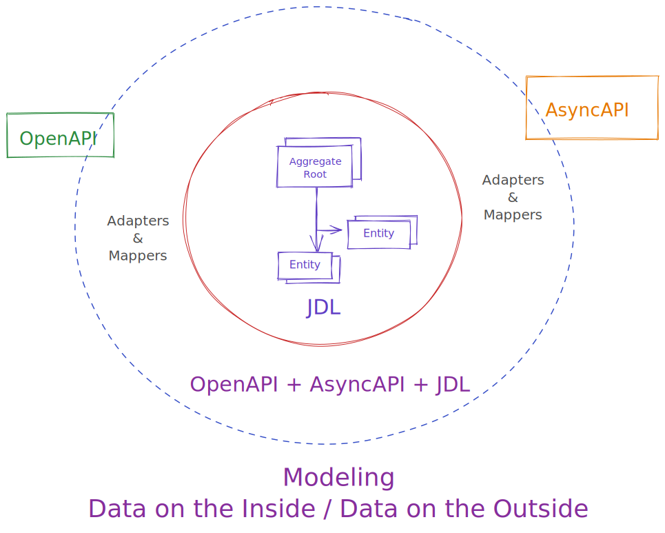
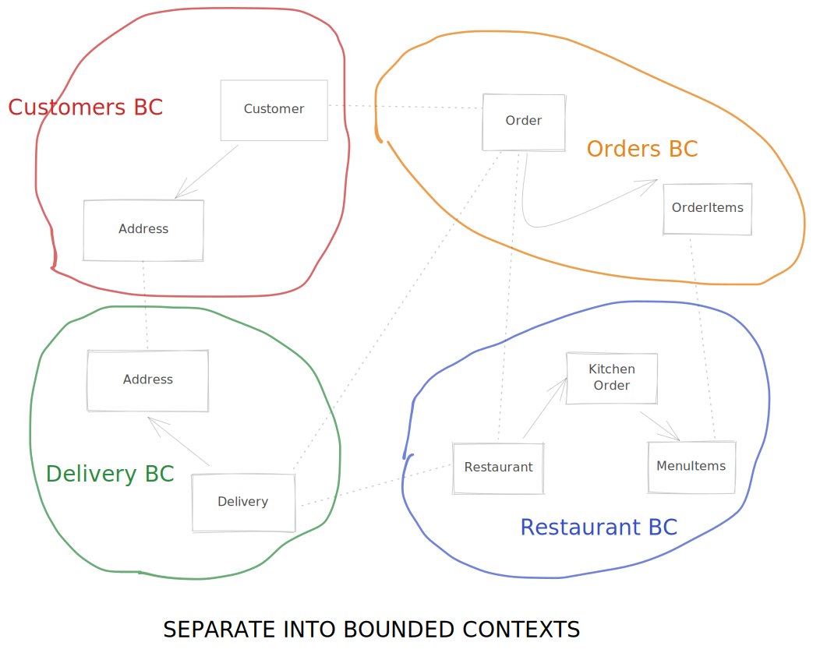
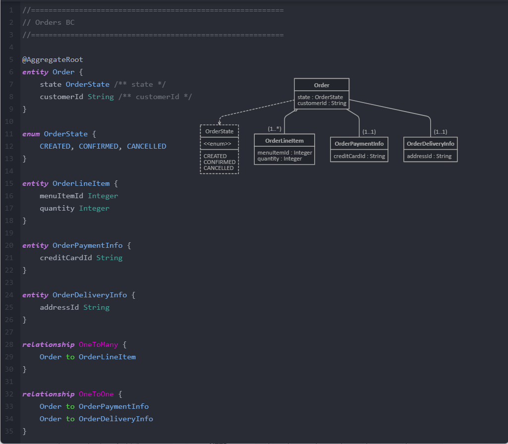
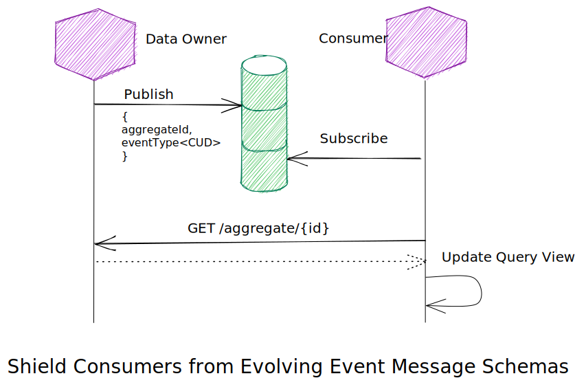

# ZenWave Code Generator

> :warning: Work in progress and not ready for use.

ZenWave Code Generator is a configurable and extensible code generator tool for **Domain Driven Design (DDD)** and **API-First** that can generate code from a mix of different models including:

- [JHipster Domain Language (JDL)](https://www.jhipster.tech/jdl/intro)
- [AsyncAPI](https://www.asyncapi.com/docs/getting-started/coming-from-openapi)
- [OpenAPI](https://swagger.io/specification/)

You can model your system architecture with JHipster Domain Language as **Ubiquitous Language** for [Data on the Inside](https://blog.acolyer.org/2016/09/13/data-on-the-outside-versus-data-on-the-inside/) and API-First specs like AsyncAPI and OpenAPI to describe Inter Process Communications (IPC) for Data on the Outside.

The main idea is:



- **JHipster Domain Language (JDL) as Ubiquitous Language:** To describe your domain core domain model
- **API-First specs like AsyncAPI and OpenAPI:** to describe Inter Process Communications (IPC) between bounded contexts/microservices.
- Use **ZenWave Code Generator** to generate (_a lot of_) infrastructure, functional and testing code from your models and APIs.

**Note:** Official provided code generator plugins are designed to generate functional code and tests on top of existing projects. Creating a base project is out of scope, but you can always go to [start.spring.io](http://start.spring.io) or [start.jhipster.tech](https://start.jhipster.tech/), in case your company doesn't already have a project starter or archetype.

# Table of Contents

- [ZenWave Code Generator](#zenwave-code-generator)
- [Table of Contents](#table-of-contents)
- [An "Online Food Delivery Service"](#an-online-food-delivery-service)
- [Designing a system from scratch with DDD and API-First](#designing-a-system-from-scratch-with-ddd-and-api-first)
  - [DDD: From Idea to JDL](#ddd-from-idea-to-jdl)
  - [API-First: Designing Inter-Service Communication](#api-first-designing-inter-service-communication)
    - [Access data owned by other bounded contexts: Direct Access vs CQRS](#access-data-owned-by-other-bounded-contexts-direct-access-vs-cqrs)
    - [Sagas](#sagas)
- [Refactoring a legacy monolith](#refactoring-a-legacy-monolith)
  - [Reverse engineering JDL from Java classes (JPA and MongoDB)](#reverse-engineering-jdl-from-java-classes-jpa-and-mongodb)
- [Adding functionality on top of an existent microservices archytecture](#adding-functionality-on-top-of-an-existent-microservices-archytecture)
  - [Reverse engineering JDL from Java classes (JPA and MongoDB)](#reverse-engineering-jdl-from-java-classes-jpa-and-mongodb-1)
  - [Reverse engineering JDL from OpenAPI definition schemas](#reverse-engineering-jdl-from-openapi-definition-schemas)
- [Generating functional and testing code: What can we generate for you today?](#generating-functional-and-testing-code-what-can-we-generate-for-you-today)
  - [JDL Server Entities (WIP)](#jdl-server-entities-wip)
  - [SpringData Repositories](#springdata-repositories)
  - [SpringData Repositories InMemory Mocks](#springdata-repositories-inmemory-mocks)
  - [OpenAPI Clients (using official OpenAPI generator)](#openapi-clients-using-official-openapi-generator)
  - [High Fidelity Stateful REST API Mocks (using sister project ZenWave ApiMock)](#high-fidelity-stateful-rest-api-mocks-using-sister-project-zenwave-apimock)
  - [AsyncAPI strongly typed interfaces and SpringCloudStreams3 implementations](#asyncapi-strongly-typed-interfaces-and-springcloudstreams3-implementations)
  - [AsyncAPI interfaces Mocks and Contract Tests (ToBeDefined)](#asyncapi-interfaces-mocks-and-contract-tests-tobedefined)
  - [SpringMVC and WebFlux Controller Stubs along with MapStruct Mappers from OpenAPI + JDL](#springmvc-and-webflux-controller-stubs-along-with-mapstruct-mappers-from-openapi--jdl)
  - [SpringMVC and WebFlux WebTestClient integration/unit tests from OpenAPI definitions](#springmvc-and-webflux-webtestclient-integrationunit-tests-from-openapi-definitions)
  - [KarateDSL Ent-to-End tests for REST APIs (using sister project ZenWave KarateIDE)](#karatedsl-ent-to-end-tests-for-rest-apis-using-sister-project-zenwave-karateide)

# An "Online Food Delivery Service"

We are going to use an hypothetical **Online Food Delivery Service** system as an example.

Whether you are [designing a system from scratch](#designing-a-system-from-scratch-with-ddd-and-api-first), [refactoring a legacy monolith](#refactoring-a-legacy-monolith) or just [Adding functionality on top of an existent microservices archytecture](#adding-functionality-on-top-of-an-existent-microservices-archytecture) ZenWave Code Generator can...

# Designing a system from scratch with DDD and API-First

## DDD: From Idea to JDL

- **Domain Map:** First sketch your full domain model:


- **Domain Subdomains:** Decompouse your model into manageable subdomains:


- **Domain Bounded Contexts:** Separate your subdomains as separated bounded contexts. Entities from different bounded context can only be linked by _id_ but you can implement _query views_ and caches using patterns like CQRS to syncronize data from different BCs.



- **Define Aggregates and Entities in your Bounded Contexts:** Now you can describe your aggregate roots and their composing entities into separate JDL files (click to expand to see file contents):

<details markdown="1">
  <summary>Orders Bounded Context.jdl</summary>

```
//==========================================================
// Orders BC
//==========================================================

/**
 * The Order entity.
 */
 @AggregateRoot
entity Order {
    state OrderState /** state */
    customerId String /** customerId */
    // orderLines OrderLineItem /** orderLines */
    // paymentInfo OrderPaymentInfo
    // deliveryInfo OrderDeliveryInfo
}

enum OrderState {
    CREATED, CONFIRMED, CANCELLED
}

entity OrderLineItem {
    menuItemId Integer
    quantity Integer
}

/**
 * The OrderPaymentInfo entity.
 */
entity OrderPaymentInfo {
    creditCardId String
}

/**
 * The OrderDeliveryInfo entity.
 */
entity OrderDeliveryInfo {
    addressId String
}

relationship OneToMany {
    Order to OrderLineItem
}

relationship OneToOne {
	Order to OrderPaymentInfo
    Order to OrderDeliveryInfo
}
```

</details>
 
<details markdown="1">
  <summary>Restaurants Bounded Context.jdl</summary>

```
//==========================================================
// Restaurants BC
//==========================================================

/**
 * The Restaurant entity.
 */
@AggregateRoot
entity Restaurant {
    name String
}

entity MenuItem {
    name String
    price Integer
}

entity RestaurantAddress {
    address String
}

entity RestaurantOrder {
	orderId String
    status RestaurantOrderStatus
}

enum RestaurantOrderStatus {
    ACCEPTED, READY, DELIVERED
}

relationship OneToMany {
	Restaurant to MenuItem
}

relationship OneToOne {
	Restaurant to RestaurantAddress
}

relationship ManyToOne {
	Restaurant to RestaurantOrder
}
```

</details>

<details markdown="1">
  <summary>Delivery Bounded Context.jdl</summary>

```
//==========================================================
// Delivery BC
//==========================================================
entity DeliveryOrder {
    orderId String
    status DeliveryOrderStatus
}

enum DeliveryOrderStatus {
    ACCEPTED, ONTRANSIT, DELIVERED
}
```

</details>

<details  markdown="1">
  <summary>Customers Bounded Context.jdl</summary>

```
//==========================================================
// Customers BC
//==========================================================

/**
 * The Customer entity.
 */
@AggregateRoot
entity Customer {
    fullName String /** fullName */
}

entity CustomerAddress {}

entity CreditCard {
    cardNumber String
}

relationship OneToMany {
	Customer to CustomerAddress
    Customer to CreditCard
}
```

</details>




## API-First: Designing Inter-Service Communication

When you separate your domain model into subdomains and bounded context, bounded contexts become a natural boundary to split your system into separate services and microservices you need to define a way to:

- Access data from other bounded contexts
- Coordinate inter process communications

### Access data owned by other bounded contexts: Direct Access vs CQRS

For every service owning data is a good idea to:

- Publish read access owned @RootAggregates as request-response services like a REST API, gRPC, GraphQL...
- Publish events of @RootAggregates changes (Create, Update, Delete) to a shared event broker as a publish-subscribe services.

This is commonly enough for other services to implement either direct synchronous access or create CQRS views.


Because APIs do evolve:

- By their synchronous nature REST APIs, if up to date, clients and services should be compatible with each other.
- But event messages depending on the event broker retention policy may live indefinitely and that complicates consumers implementation as they may need to know how to process different evolving message formats.

An easy way to simplify consumers implementation, regarding evolving message formats:

- Just publish the aggregate ID and the event type (Create, Update, Delete) to the event broker.
- Let the consumers use the REST API to fetch data synchronously.



### Sagas

Currently, you can use AsyncAPI 2 specification to describe message schemas and the channels they are written to but is not enough to describe the inter process communication between services like SAGAs but [ongoing work for version 3](https://github.com/asyncapi/spec/issues/618) is very promissing regarding documenting IPCs like SAGAs and CQRS.

With new upcoming version of AsyncAPI 3, you can separate how you describe on separate files:

- Channels, messages and servers
- Applications connected to those channels

<details markdown="1">
  <summary>Food Delivery Service Order's Saga Asyncapi.yml example</summary>

```yaml
asyncapi: 3.0.0

info:
  title: Food Delivery Service Order's Saga
  version: 0.1.0

components:
  servers:

  channels:
    ordersSagaCommonChannel:
      address: orders/saga
      message:
        oneOf:
          - $ref: "#/components/messages/onOrderCreated"
          - $ref: "#/components/messages/onOrderAcceptedAtRestaurant"
          - $ref: "#/components/messages/onOrderReadyForPickup"
          - $ref: "#/components/messages/onOrderAcceptedAtDelivery"
          - $ref: "#/components/messages/onOrderPickedUp"
          - $ref: "#/components/messages/onOrderDeliveryStatusUpdated"
          - $ref: "#/components/messages/onOrderDelivered"
```

</details>

<details markdown="1">
  <summary>Applications connected to those channels: Restaurant Service Asyncapi.yml example</summary>

```yaml
asyncapi: 3.0.0

info:
  title: Restaurant Service
  version: 1.0.0

servers:
  kafka:
    $ref: "orders.saga.asyncapi.yaml#/components/servers/kafka"

channels:
  ordersSagaCommonChannel:
    $ref: "orders.saga.asyncapi.yaml#/components/channels/ordersSagaCommonChannel"

# Notice how each operation specifies/overrides which message/s is interested in
operations:
  onOrderCreated:
    description: Join the orders saga.
    action: receive
    channel: ordersSagaCommonChannel
    message:
      $ref: "orders.saga.asyncapi.yaml#/components/messages/onOrderCreated"
  onOrderAcceptedAtRestaurant:
    description: Restaurant informs is committed to prepare the order.
    action: send
    channel: ordersSagaCommonChannel
    message:
      $ref: "orders.saga.asyncapi.yaml#/components/messages/onOrderAcceptedAtRestaurant"
  onOrderReadyForPickup:
    description: Restaurant informs order is ready to pick up.
    action: send
    channel: ordersSagaCommonChannel
    message:
      $ref: "orders.saga.asyncapi.yaml#/components/messages/onOrderReadyForPickup"
```

</details>


# Refactoring a legacy monolith

## Reverse engineering JDL from Java classes (JPA and MongoDB)

If starting with legacy project, you can reverse engineer JDL from Java entity classes. JPA and MongoDB are supported.

It requires access to your project classpath so you can just paste the following code on any test class or main method:

```java
String jdl = new JavaToJDLGenerator()
    .withPackageName("io.zenwave360.generator.jpa2jdl")
    .withPersistenceType(JavaToJDLGenerator.PersistenceType.JPA)
    .generate();
System.out.println(jdl);
```

```java
String jdl = new JavaToJDLGenerator()
    .withPackageName("io.zenwave360.generator.mongodb2jdl")
    .withPersistenceType(JavaToJDLGenerator.PersistenceType.MONGODB)
    .generate();
System.out.println(jdl);
```

# Adding functionality on top of an existent microservices archytecture

## Reverse engineering JDL from Java classes (JPA and MongoDB)

When your domain java code evolves you may want to regenerate entities back from java code, see: [Reverse engineering JDL from Java classes (JPA and MongoDB)](#reverse-engineering-jdl-from-java-classes-jpa-and-mongodb)

## Reverse engineering JDL from OpenAPI definition schemas

Reverse engineer JDL entities from OpenAPI schemas:

```shell
jbang zw -p io.zenwave360.generator.plugins.OpenAPIToJDLConfigurationPreset \
    specFile=openapi.yml targetFolder=target/out targetFile=entities.jdl
cat target/out/entities.jdl
```

# Generating functional and testing code: What can we generate for you today?

Aims to generate a complete Architecture based on Domain models expressed in JDL.


## JDL Server Entities (WIP)

Generates entities annotated for persistence you can use as your core domaind aggregates.

**NOTE:** We are very opinionated about not to hide annotated entities behind plain DTOs and MapStruct mappers (addapters in Hexagonal parlance) and take advantage of your ORM/ODM persistence framework semantics, and not hide them behind an extra layer of DTOs which will leave you in a _common-lowest-denominator_ land.

So we would generate:

- Annotated entities as core domain model aggregates, data on the inside.
- Persistence Repositories as secondary ports for the annotated entities.

```shell
jbang zw -p io.zenwave360.generator.plugins.JDLEntitiesConfigurationPreset \
    specFile=entities-model.jdl targetFolder=target/out
```

## SpringData Repositories

_TODO_: Generate SpringData Repository interfaces for every @AggregateRoot entity.

## SpringData Repositories InMemory Mocks

_TODO_: Generate InMemory (with simple hashmaps) implementation for SpringData Repositories along with some sample data (probably in easily editable yaml format).

## OpenAPI Clients (using official OpenAPI generator)

_TODO_

## High Fidelity Stateful REST API Mocks (using sister project ZenWave ApiMock)

See sister project [ZenWave ApiMock](https://github.com/ZenWave360/zenwave-apimock)

See also medium article: [High Fidelity Stateful Mocks (Consumer Contracts) with OpenAPI and KarateDSL @medium](https://medium.com/@ivangsa/high-fidelity-stateful-mocks-consumer-contracts-with-openapi-and-karatedsl-85a7f31cf84e)

## AsyncAPI strongly typed interfaces and SpringCloudStreams3 implementations

Generates strongly typed java code (Producer and Consumers) for Spring Cloud Streams 3 from AsyncAPI specification.

It supports:

- Imperative and Reactive styles
- Exposing your DTOs, Spring Messages or Kafka KStreams as parameter types.
- All message formats supported by AsyncAPI specification: AsyncAPI schema (inline), JSON Schema (external files) and Avro (external files).

> NOTE: some templates/combinations are still WIP

```shell
jbang zw -p io.zenwave360.generator.plugins.SpringCloudStream3ConfigurationPreset \
    specFile=asyncapi.yml targetFolder=target/out \
    apiPackage=io.example.integration.test.api \
    modelPackage=io.example.integration.test.api.model \
    role=<PROVIDER | CLIENT> \
    style=<IMPERATIVE | REACTIVE>
```

## AsyncAPI interfaces Mocks and Contract Tests (ToBeDefined)

_TODO_: Use Pact.io? Spring Cloud Contract? Roll your own?

## SpringMVC and WebFlux Controller Stubs along with MapStruct Mappers from OpenAPI + JDL

_TODO_: We can generate a lot of code to get you started to implement every new endpoint... so you can just fill in the missing details and implement your service business rules.

## SpringMVC and WebFlux WebTestClient integration/unit tests from OpenAPI definitions

Generates test for SpringMVC or Spring WebFlux using WebTestClient based on OpenAPI specification.

```shell
jbang zw -p io.zenwave360.generator.plugins.SpringWebTestsClientConfigurationPreset \
    specFile=openapi.yml targetFolder=target/out \
    apiPackage=io.example.integration.test.api \
    modelPackage=io.example.integration.test.api.model \
    groupBy=<SERVICE | OPERATION | PARTIAL> \
    operationIds=<comma separated or empty for all> \
    statusCodes=<comma separated or empty for default>
```

## KarateDSL Ent-to-End tests for REST APIs (using sister project ZenWave KarateIDE)

Use sister project [ZenWave KarateIDE](https://marketplace.visualstudio.com/items?itemName=KarateIDE.karate-ide)

[](https://www.youtube.com/watch?v=pYyRvly4cG8)

You can also find to deep dives into Contract Testing and API Mocking in this two medium articles:

- [Generating Karate Test Features from OpenAPI @medium](https://medium.com/@ivangsa/from-manual-to-contract-testing-with-karatedsl-and-karateide-i-5884f1732680#8311)
- [Generate Tests that simulates end-user Business Flows @medium](https://medium.com/@ivangsa/from-manual-to-contract-testing-with-karatedsl-and-karateide-i-5884f1732680#9b70)
